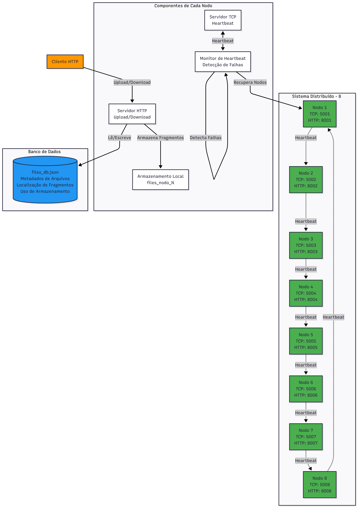
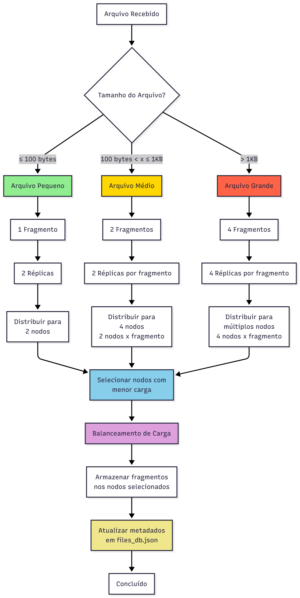
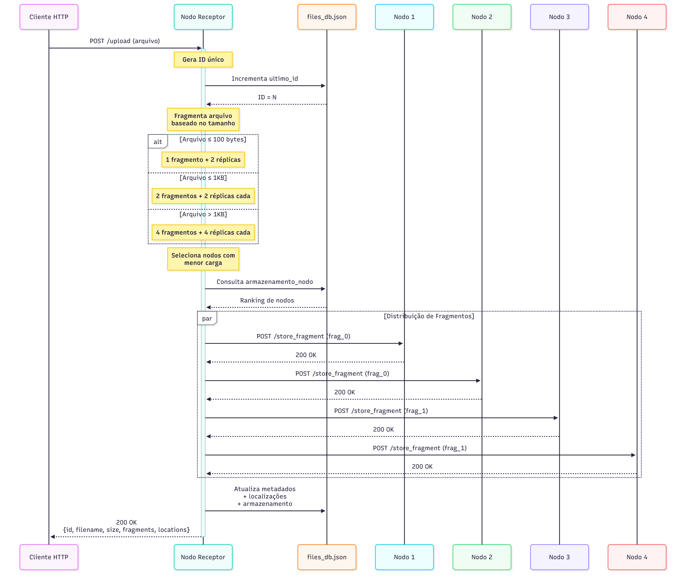
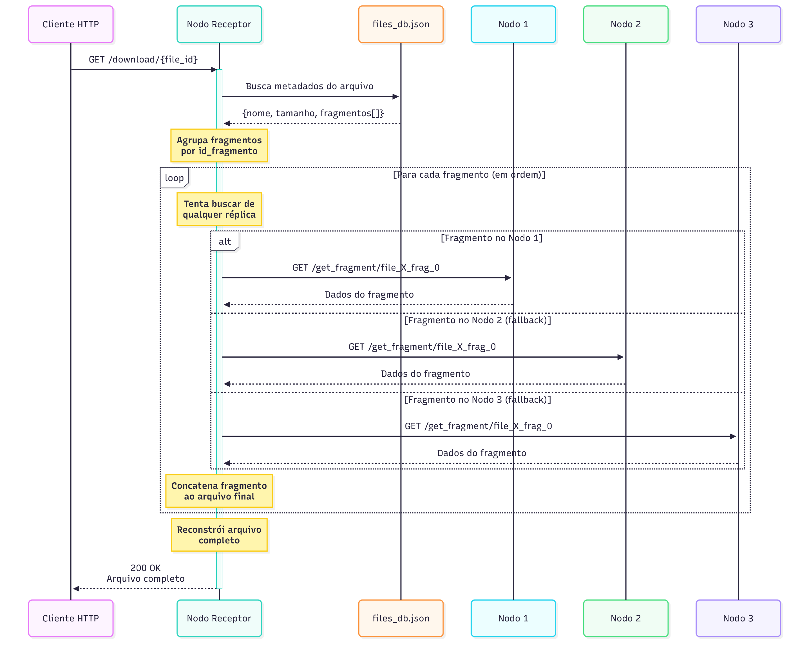
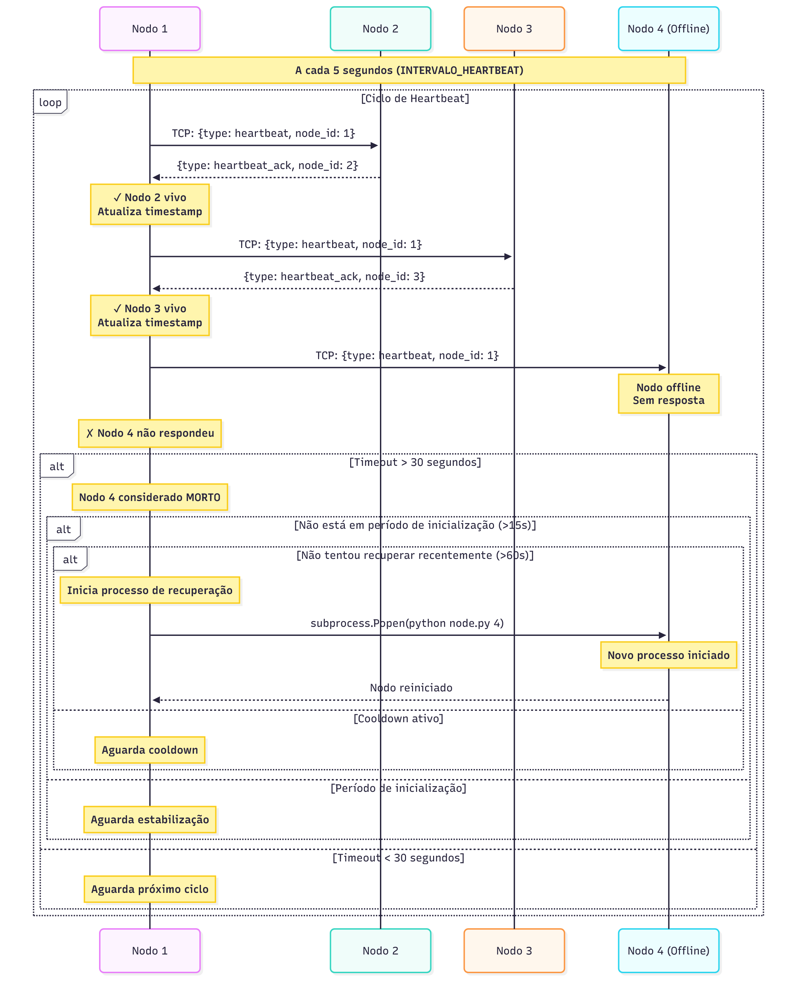
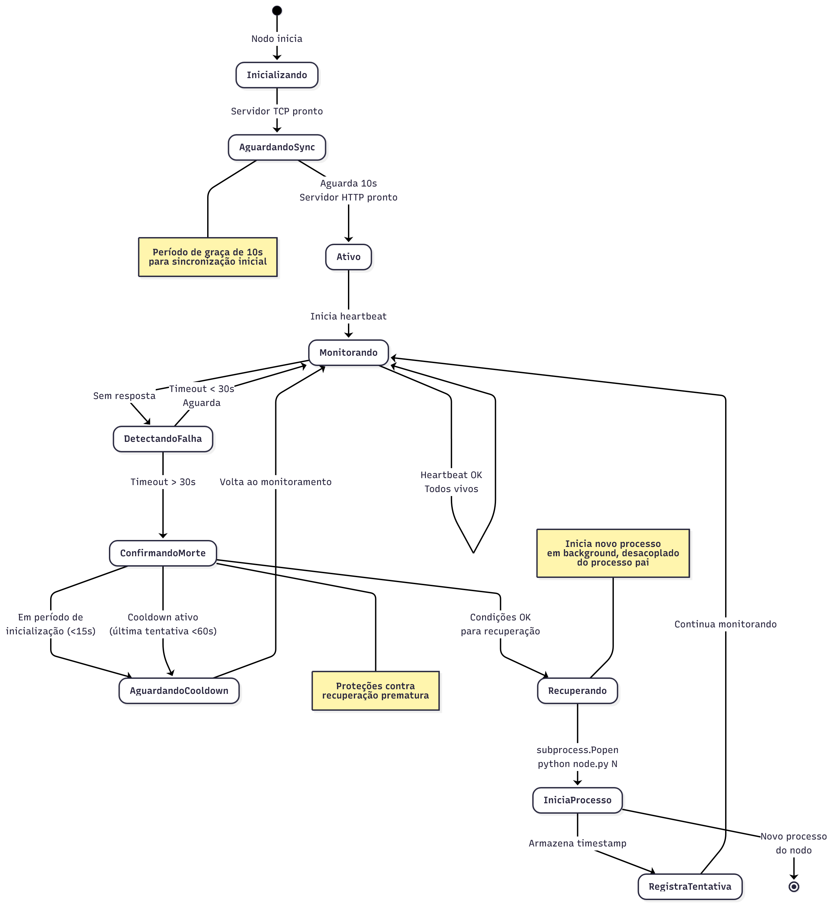
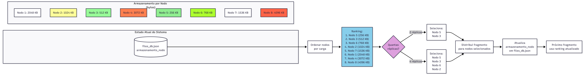

# 🗂️ ShardBox

**Sistema de Arquivos Distribuído Peer-to-Peer**

ShardBox é um sistema de armazenamento distribuído com 8 nodos, implementando fragmentação inteligente de arquivos, replicação automática, balanceamento de carga e recuperação de falhas.

## 📋 Índice

- [Visão Geral](#-visão-geral)
- [Características Principais](#-características-principais)
- [Arquitetura do Sistema](#-arquitetura-do-sistema)
- [Como Funciona](#-como-funciona)
  - [Fragmentação de Arquivos](#fragmentação-de-arquivos)
  - [Upload de Arquivos](#upload-de-arquivos)
  - [Download de Arquivos](#download-de-arquivos)
  - [Monitoramento e Heartbeat](#monitoramento-e-heartbeat)
  - [Recuperação de Nodos](#recuperação-de-nodos)
  - [Balanceamento de Carga](#balanceamento-de-carga)
- [Começando](#-começando)
- [API HTTP](#-api-http)
- [Configuração](#️-configuração)
- [Estrutura de Diretórios](#-estrutura-de-diretórios)

---

## 🎯 Visão Geral

Este projeto implementa um sistema de arquivos distribuído inspirado em sistemas como S3, mas usando uma arquitetura peer-to-peer simples. Cada nodo atua simultaneamente como cliente e servidor, possibilitando:

- **Fragmentação inteligente** baseada no tamanho do arquivo
- **Replicação automática** para garantir disponibilidade
- **Balanceamento de carga** distribuindo fragmentos para nodos com menor uso
- **Detecção e recuperação automática** de nodos que falharam
- **Banco de dados compartilhado** para metadados e localização de fragmentos

---

## ✨ Características Principais

| Característica | Descrição |
|---------------|-----------|
| **🔄 Alta Disponibilidade** | Réplicas múltiplas garantem acesso mesmo com falhas de nodos |
| **⚖️ Balanceamento Automático** | Distribui fragmentos baseado na carga de cada nodo |
| **❤️ Monitoramento Contínuo** | Heartbeat a cada 5 segundos detecta falhas rapidamente |
| **🔧 Auto-recuperação** | Nodos mortos são automaticamente reiniciados |
| **📊 Fragmentação Adaptativa** | Estratégia de fragmentação varia com o tamanho do arquivo |
| **🔒 Thread-Safe** | Acesso concorrente ao banco de dados protegido por locks |

---

## 🏗️ Arquitetura do Sistema



O sistema é composto por **8 nodos** idênticos, cada um executando:

### Componentes de Cada Nodo

- **Servidor TCP (portas 5001-5008)**: Comunicação entre nodos para heartbeat
- **Servidor HTTP (portas 8001-8008)**: Interface REST para upload/download
- **Armazenamento Local**: Diretório dedicado `files_nodo_N` para fragmentos
- **Monitor de Heartbeat**: Thread dedicada para detectar falhas
- **Logger**: Registro de eventos em `log/nodo_N.log`

### Banco de Dados Compartilhado

O arquivo `files_db.json` armazena:
- **Metadados de arquivos**: ID, nome, tamanho total
- **Localização de fragmentos**: Qual nodo possui qual fragmento
- **Uso de armazenamento**: Bytes armazenados por cada nodo
- **Último ID**: Contador global para IDs únicos

---

## 🔬 Como Funciona

### Fragmentação de Arquivos



A estratégia de fragmentação varia baseada no tamanho do arquivo:

| Tamanho do Arquivo | Fragmentos | Réplicas por Fragmento | Total de Cópias |
|-------------------|-----------|------------------------|-----------------|
| ≤ 100 bytes | 1 | 2 | 2 nodos |
| 100 bytes - 1 KB | 2 | 2 | 4 nodos |
| > 1 KB | 4 | 4 | até 16 cópias |

**Vantagens:**
- Arquivos pequenos: mínima overhead, rápida replicação
- Arquivos médios: balanceamento entre performance e redundância
- Arquivos grandes: máxima distribuição e paralelismo

### Upload de Arquivos



**Processo de Upload:**

1. Cliente envia arquivo via `POST /upload`
2. Nodo receptor gera ID único
3. Arquivo é fragmentado baseado no tamanho
4. Sistema consulta `armazenamento_nodo` para encontrar nodos com menor carga
5. Fragmentos são distribuídos via `POST /store_fragment`
6. Metadados são atualizados no banco de dados compartilhado
7. Cliente recebe confirmação com detalhes do armazenamento

**Exemplo de resposta:**
```json
{
  "id": 42,
  "filename": "documento.pdf",
  "size": 2048576,
  "fragments": 4,
  "locations": [
    {"id_nodo": 3, "id_fragmento": 0, "tamanho": 512144},
    {"id_nodo": 5, "id_fragmento": 0, "tamanho": 512144},
    ...
  ]
}
```

### Download de Arquivos



**Processo de Download:**

1. Cliente solicita arquivo via `GET /download/{file_id}`
2. Nodo receptor consulta metadados no banco de dados
3. Para cada fragmento (em ordem):
   - Tenta buscar de qualquer réplica disponível
   - Se um nodo falhar, tenta o próximo automaticamente
4. Fragmentos são concatenados na ordem correta
5. Arquivo completo é retornado ao cliente

**Redundância garante disponibilidade:** Mesmo se 1-3 nodos falharem, o arquivo ainda pode ser recuperado das réplicas.

### Monitoramento e Heartbeat



**Sistema de Monitoramento:**

- **Intervalo:** Heartbeat enviado a cada 5 segundos (configurável via `.env`)
- **Timeout:** Nodo considerado morto após 30 segundos sem resposta
- **Protocolo:** TCP com mensagens JSON
- **Mensagem:** `{"type": "heartbeat", "node_id": N, "port": 500X}`
- **Resposta:** `{"type": "heartbeat_ack", "node_id": N, "port": 500X}`

**Detecção de Falhas:**
```
Heartbeat OK → Atualiza timestamp do nodo
Sem resposta → Incrementa contador de falhas
Timeout > 30s → Marca como MORTO → Inicia recuperação
```

### Recuperação de Nodos



**Processo de Recuperação Automática:**

Quando um nodo é detectado como morto, o sistema:

1. **Verifica período de inicialização**: Não tenta recuperar nos primeiros 15 segundos
2. **Verifica cooldown**: Aguarda 60 segundos entre tentativas de recuperação
3. **Inicia novo processo**:
   ```python
   subprocess.Popen(
       [sys.executable, 'node.py', str(id_nodo)],
       start_new_session=True  # Desacoplado do processo pai
   )
   ```
4. **Registra tentativa**: Armazena timestamp para evitar duplicação

**Proteções Implementadas:**
- ✅ Cooldown de 60 segundos entre tentativas
- ✅ Período de graça de 15 segundos após inicialização
- ✅ Aguarda 10 segundos antes de iniciar monitoramento
- ✅ Evita race conditions em alocação de portas

### Balanceamento de Carga



**Algoritmo de Distribuição:**

1. Consulta `armazenamento_nodo` no banco de dados
2. Ordena nodos por quantidade de bytes armazenados (crescente)
3. Seleciona os N nodos com menor carga (N = número de réplicas)
4. Distribui fragmento para os nodos selecionados
5. Atualiza contador de armazenamento de cada nodo

**Exemplo:**
```
Ranking atual:
1. Nodo 5: 256 KB  ← Selecionado
2. Nodo 3: 512 KB  ← Selecionado
3. Nodo 6: 768 KB
4. Nodo 2: 1024 KB
...

Para um fragmento de 100KB com 2 réplicas:
→ Armazena em Nodo 5 (256KB → 356KB)
→ Armazena em Nodo 3 (512KB → 612KB)
```

---

## 🚀 Começando

### Pré-requisitos

- Python 3.8+
- pip
- Ambiente virtual (recomendado)

### Instalação

```bash
# Clone o repositório
git clone https://github.com/FabioHAraujo/ShardBox.git
cd ShardBox

# Crie e ative o ambiente virtual
python3 -m venv venv
source venv/bin/activate  # Linux/Mac
# ou
.\venv\Scripts\activate  # Windows

# Instale as dependências
pip install -r requirements.txt
```

### Iniciar o Sistema

```bash
# Inicia todos os 8 nodos
./inicia_tudo.sh

# Verificar logs
tail -f log/nodo_*.log

# Parar todos os nodos
./mata_nodo.sh 0

# Resetar o sistema (apaga arquivos e banco de dados)
./reseta_projeto.sh
```

### Iniciar Nodos Individualmente

```bash
# Inicia um nodo específico (1-8)
python node.py 1
```

---

## 📡 API HTTP

Todos os nodos expõem a mesma API REST nas portas 8001-8008.

### Upload de Arquivo

**Endpoint:** `POST /upload`

**Request:**
```bash
curl -X POST -F "file=@documento.pdf" http://localhost:8001/upload
```

**Response (200 OK):**
```json
{
  "id": 42,
  "filename": "documento.pdf",
  "size": 204800,
  "fragments": 2,
  "locations": [
    {"id_nodo": 3, "id_fragmento": 0, "tamanho": 102400},
    {"id_nodo": 5, "id_fragmento": 0, "tamanho": 102400},
    {"id_nodo": 2, "id_fragmento": 1, "tamanho": 102400},
    {"id_nodo": 7, "id_fragmento": 1, "tamanho": 102400}
  ]
}
```

### Download de Arquivo

**Endpoint:** `GET /download/{file_id}`

**Request:**
```bash
curl http://localhost:8001/download/42 -o documento.pdf
```

**Response:** Arquivo binário completo

### Listar Arquivos

**Endpoint:** `GET /list`

**Request:**
```bash
curl http://localhost:8001/list
```

**Response (200 OK):**
```json
{
  "files": [
    {"id": 1, "name": "foto.jpg", "size": 512000},
    {"id": 2, "name": "video.mp4", "size": 10485760},
    {"id": 3, "name": "documento.pdf", "size": 204800}
  ]
}
```

### Armazenar Fragmento (Interno)

**Endpoint:** `POST /store_fragment`

**Uso:** Comunicação entre nodos (não destinado a uso direto)

### Buscar Fragmento (Interno)

**Endpoint:** `GET /get_fragment/{fragment_filename}`

**Uso:** Comunicação entre nodos durante downloads

---

## ⚙️ Configuração

Edite o arquivo `.env` para configurar o sistema:

```bash
# Portas TCP para comunicação entre nodos (heartbeat)
PORTAS=5001,5002,5003,5004,5005,5006,5007,5008

# Intervalo entre heartbeats (segundos)
INTERVALO_HEARTBEAT=5

# Timeout para considerar nodo offline (segundos)
TIMEOUT_HEARTBEAT=30

# Portas HTTP para API REST (cliente)
PORTAS_HTTP=8001,8002,8003,8004,8005,8006,8007,8008
```

**Parâmetros Importantes:**

- `INTERVALO_HEARTBEAT`: Menor = detecção mais rápida, maior overhead
- `TIMEOUT_HEARTBEAT`: Deve ser maior que `INTERVALO_HEARTBEAT * 2`
- Portas TCP e HTTP devem ter exatamente 8 valores (um por nodo)

---

## 📁 Estrutura de Diretórios

```
ShardBox/
├── node.py                    # Código principal do nodo
├── .env                       # Configurações do sistema
├── .gitignore                 # Arquivos ignorados pelo Git
├── inicia_tudo.sh            # Script para iniciar todos os nodos
├── mata_nodo.sh              # Script para parar nodos
├── reseta_projeto.sh         # Script para resetar o sistema
├── requirements.txt          # Dependências Python
│
├── docs/                     # Documentação e diagramas
│   ├── architecture.mermaid
│   ├── architecture.png
│   ├── download-flow.mermaid
│   ├── download-flow.png
│   ├── fragmentation-strategy.mermaid
│   ├── fragmentation-strategy.png
│   ├── heartbeat-flow.mermaid
│   ├── heartbeat-flow.png
│   ├── load-balancing.mermaid
│   ├── load-balancing.png
│   ├── node-recovery.mermaid
│   ├── node-recovery.png
│   ├── upload-flow.mermaid
│   └── upload-flow.png
│
├── log/                      # Logs de cada nodo (gerado em runtime)
│   ├── nodo_1.log
│   ├── nodo_2.log
│   └── ...
│
├── files_nodo_1/             # Armazenamento do nodo 1 (gerado em runtime)
├── files_nodo_2/             # Armazenamento do nodo 2 (gerado em runtime)
├── ...                       # (8 diretórios no total)
│
└── files_db.json             # Banco de dados compartilhado (gerado em runtime)
```

### Estrutura do `files_db.json`

```json
{
  "ultimo_id": 5,
  "arquivos": {
    "1": {
      "nome": "exemplo.txt",
      "tamanho": 150,
      "fragmentos": [
        {"id_nodo": 3, "id_fragmento": 0, "tamanho": 75},
        {"id_nodo": 5, "id_fragmento": 0, "tamanho": 75},
        {"id_nodo": 2, "id_fragmento": 1, "tamanho": 75},
        {"id_nodo": 7, "id_fragmento": 1, "tamanho": 75}
      ]
    }
  },
  "armazenamento_nodo": {
    "1": 0,
    "2": 75,
    "3": 75,
    "4": 0,
    "5": 75,
    "6": 0,
    "7": 75,
    "8": 0
  }
}
```

---

## 🧪 Testando o Sistema

### Teste Básico de Upload/Download

```bash
# 1. Inicie o sistema
./inicia_tudo.sh

# 2. Crie um arquivo de teste
echo "Hello, Distributed World!" > teste.txt

# 3. Faça upload
curl -X POST -F "file=@teste.txt" http://localhost:8001/upload

# 4. Liste arquivos
curl http://localhost:8001/list

# 5. Faça download (use o ID retornado)
curl http://localhost:8001/download/1 -o teste_downloaded.txt

# 6. Verifique o conteúdo
cat teste_downloaded.txt
```

### Teste de Recuperação de Falhas

```bash
# 1. Mate um nodo específico
./mata_nodo.sh 3

# 2. Observe os logs - outros nodos detectarão a falha
tail -f log/nodo_1.log

# 3. Aguarde ~30 segundos - nodo será recuperado automaticamente

# 4. Verifique que o nodo voltou
tail -f log/nodo_3.log
```

### Teste de Balanceamento

```bash
# Upload múltiplos arquivos e observe a distribuição
for i in {1..10}; do
  echo "Arquivo $i com conteúdo variável" > file_$i.txt
  curl -X POST -F "file=@file_$i.txt" http://localhost:8001/upload
done

# Verifique o armazenamento de cada nodo
cat files_db.json | jq '.armazenamento_nodo'
```

---

## 🎓 Conceitos Técnicos

### Thread Safety

O sistema utiliza locks (`threading.Lock`) para garantir acesso thread-safe ao banco de dados compartilhado:

```python
with self.lock_bd:
    # Operações no files_db.json são atômicas
    dados = json.load(f)
```

### Process Management

Recuperação de nodos usa `subprocess.Popen` com `start_new_session=True` para desacoplar processos filhos do processo pai, garantindo que nodos recuperados sobrevivam mesmo se o nodo que iniciou a recuperação falhar.

### Race Condition Prevention

- **Período de graça de 10 segundos** após inicialização
- **Proteção contra recuperação prematura** (primeiros 15 segundos)
- **Cooldown de 60 segundos** entre tentativas de recuperação
- **Intervalo de 1 segundo** entre inicialização de nodos no script

---

## 📊 Limitações Conhecidas

- Banco de dados JSON é compartilhado por arquivo (não ideal para alta concorrência)
- Não há autenticação ou autorização
- Sistema assume rede local confiável (localhost)
- Sem criptografia de dados em trânsito
- Não implementa garbage collection de fragmentos órfãos

---

## 🔮 Melhorias Futuras

- [ ] **Migrar para banco de dados distribuído** onde todos os nodos mantêm cópia dos metadados, eliminando ponto único de falha:
  - **Apache Cassandra**: Alta disponibilidade, escalabilidade linear
  - **CouchDB**: Replicação multi-master, eventual consistency
  - **Riak**: Tolerância a partições, modelo key-value
  - **ScyllaDB**: Alta performance, compatível com Cassandra
  - Ou implementar protocolo de consenso (Raft/Paxos) com replicação de estado
- [ ] Implementar API de autenticação e autorização
- [ ] Adicionar compressão de fragmentos antes do armazenamento
- [ ] Implementar checksums (SHA-256) para verificar integridade dos fragmentos
- [ ] Dashboard web para monitoramento em tempo real do cluster
- [ ] Suporte a múltiplas máquinas físicas (não apenas localhost)
- [ ] Implementar CRDT (Conflict-free Replicated Data Types) para sincronização sem conflitos

---

## 📝 Licença

Este projeto é de código aberto e disponível para fins educacionais.

---

## 👥 Contribuindo

Contribuições são bem-vindas! Por favor:

1. Fork o projeto em [github.com/FabioHAraujo/ShardBox](https://github.com/FabioHAraujo/ShardBox)
2. Crie uma branch para sua feature (`git checkout -b feature/AmazingFeature`)
3. Commit suas mudanças (`git commit -m 'Add some AmazingFeature'`)
4. Push para a branch (`git push origin feature/AmazingFeature`)
5. Abra um Pull Request

---

**Desenvolvido com ❤️ para a matéria de Sistemas Distribuídos - Universidade Feevale**
